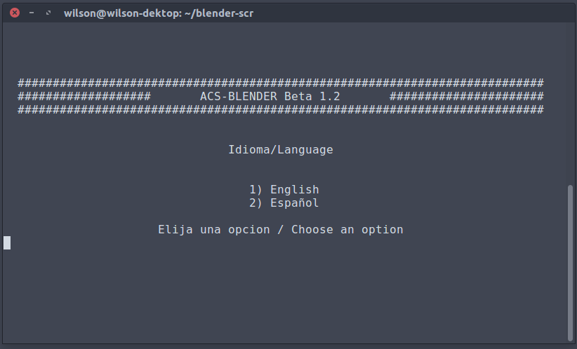

# acs-blender 1.3

<h2>Auto compile script for blender</h2>

This script helps to compile blender 3d source code. What this really does is give a easy way to compile blender without going through all the steps on the blender dev page.

<ul>
<li>Only tested on ubuntu and fedora</li>
<li>Run "./acs-blender.sh" using the comand line</li>
<li>To update the code and recompile add the argument <code>recompile</code> example:  <code>./acs-blender.sh recompile</code>
</ul>
<h2>Release notes</h2>
<h3>1.3)
<ul>
<li>Now full compilation including OSL and LLVM</li>
<li>Deleted anoying "Press Enter" to continue</li>
</ul> 

Now support compiling with OSL and LLVM</h3>

<h2>Script de autocompilacion de blender 3d</h2>

Este script ayuda a compilar el codigo fuente de blender. Lo que hace es dar una manera facil de compilar blender sin tener que ir por todo el proceso que se indica en la pagina de desarrollo de blender.

<ul>
<li>Solamente lo he probado en Ubuntu y Fedora</li>
<li>Ejecuta "./acs-blender.sh" utilizando la consola de comandos</li>
<li>Agregada la opcion de actualizar el codigo y compilarlo agregando el argumento <code>recompilar</code> ejemplo:  <code>./acs-blender.sh recompilar</code></li>
</ul>
<h2>Notas de la version</h2>
<h3>1.3)</h3>
<ul>
<li>Ahora compilacion total incluyendo OSL y LLVM</li>
<li>Eliminada la molesta opcion de "Presione enter" para continuar</li>
</ul> 

